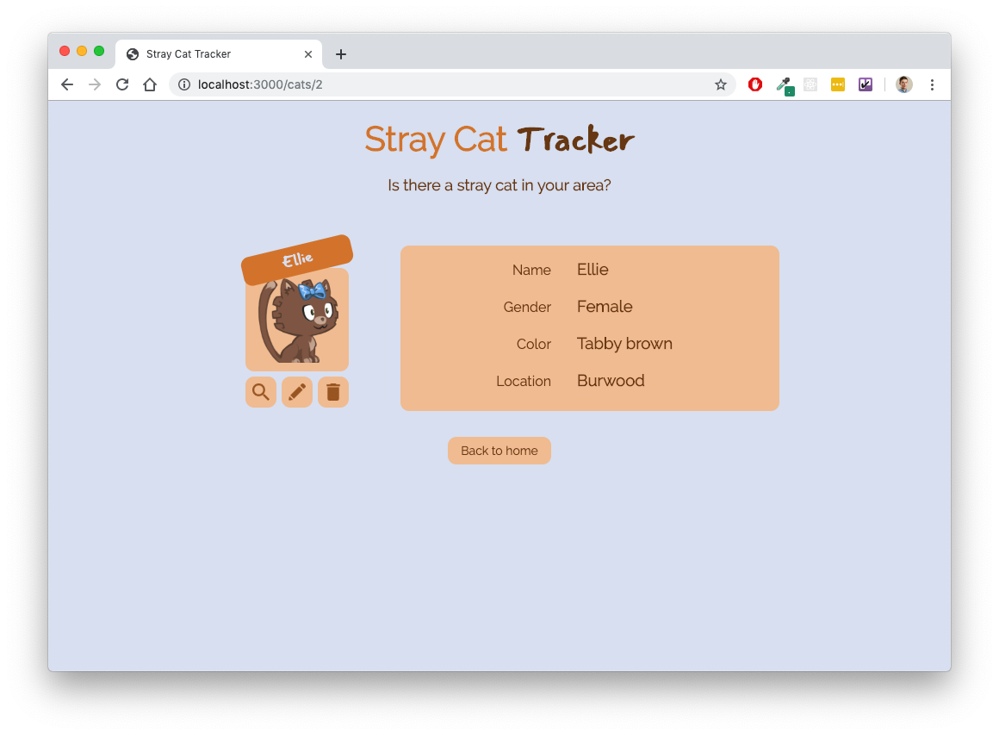
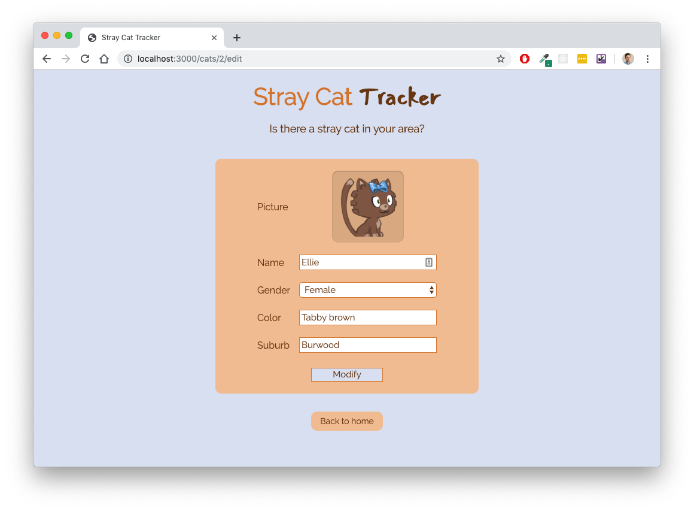
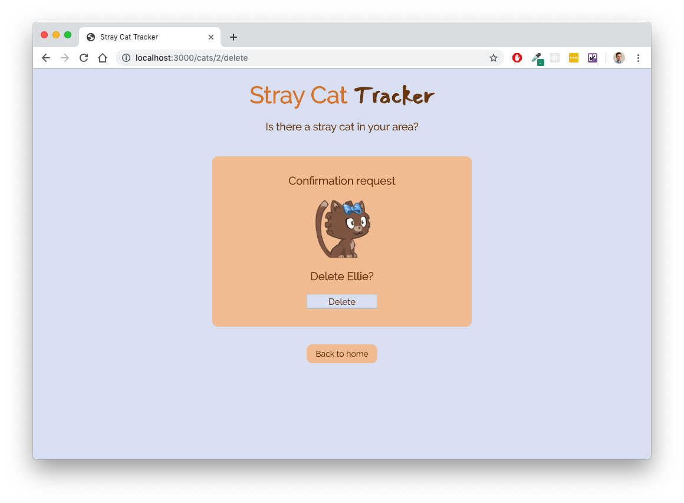

# README

Live: [https://stray-cat-tracker.herokuapp.com/cats](https://stray-cat-tracker.herokuapp.com/cats)

Repo: [github.com/ironest/stray-cat-tracker](https://github.com/ironest/stray-cat-tracker)

Contributors: [Riccardo Carzaniga](https://github.com/ironest)

## Description

Stray-Cat-Tracker comes from an idea of pulling together all those nice people who love cats and are willing to collaborate to track on a centralized online application a database of stray cats info. Eventually, volunteers might visit the reported places to carry out general duties such as feeding, cure, desexing, fostering etc.

The web app is still a beta, with random generated data but, it allows user to experience every CRUD functionality:
 * Report a new cat
 * Inspect details of a cat from the database
 * Edit/modify a cat information
 * Delete an entry

## Screenshots

## Prerequisites

* Ruby version 2.6.3

* Rails

* No database required as the project has been generated with -O option, (--skip-active-record)

* No test suite at this stage
